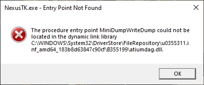
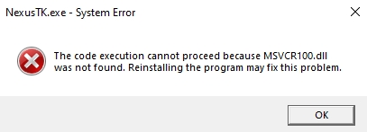
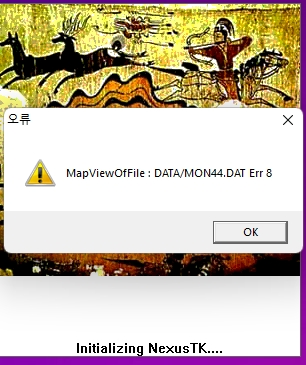

# Technical Troubleshooting

## Display settings

There's a display settings utility in the NexusTK install directory that can toggle between fullscreen, windowed at different resolutions, and between different rendering methods. See what works best for you.

Windows Compatability settings for the client exe can also help with some display issues - try Windows 8 compatability mode and "use legacy display ICC color management".

Within windows compatability settings you can also override standard dpi scaling settings, as these don't always play nicely with NTK's rendering, particularly for fonts.

## "MiniDumpWriteDump"

NTK's copy of the dbghlp.dll is trying to invoke a function in your graphics drivers that doesn't exist. Luckily you can simply delete the copy of dbghlp.dll in the NexusTK install directory - the client will instead use your system's normal copy of dbghlp, which shouldn't exhibit this issue.

## "MSVCR100.dll"

Fix this by installing the Visual C++ 2010 Redistributable Package. You can find this linked from the same page as the client download on <www.nexustk.com>.

## "MapViewOfFile"

NTK wants to load this entire file into a single continuous piece of memory. However, the system hasn't given NTK a big enough single continuous piece of memory to do this. Doing just about anything with your computer, including a reboot, may be enough to rearrange your computer's memory enough to allow NTK to map this file.

However, you can make this issue massively less likely by setting NTK to Large Address Aware. As a 32-bit application, NTK is incapable of referencing more than 4gb of memory, and like most 32-bit applications, it is limited to 2gb because a 32-bit operating system (operating under the same constraint) needs the other half for itself. This no longer applies on modern 64-bit operating systems, so by setting a flag in the .exe, we can allow NTK to use the whole 4gb that it's capable of handling. Utilities like <https://ntcore.com/4gb-patch/> make this straightforward. After doing this, you should rarely if ever encounter this issue.

## Unthemed Cursor

NTK should include a themed cursor, but seemingly the animation files for this cursor are missing from the current NTK installer. Thankfully you can just put the files back. Download the scary .zip directly from welcometonexus.net here: [Cursor animations archive](files/Cursor.zip). Place the "Cursor" folder inside into the NexusTK installation directory, at the same level as NexusTK.exe - cursor should be restored.

## Freezing on Second Monitor

This is a tricky one. It seems to apply mostly to people who already had the client installed at the point the display changes rolled out. I personally fixed mine by explicitly uninstalling NexusTK via add/remove programs before reinstalling, on the grounds that the uninstaller cleanup might do something useful. I've never managed to reproduce the issue again, so I've not worked out precisely what did it.

## Can't Connect

There are many possible causes of connection issues.

Blocked ports are a common one. Commercial / hotel networks will often block nonstandard ports. NTK requires ports 2000 through 2004, as far as I am aware. You can check your outward port access with <http://portquiz.net:2000/> etc, adjusting the port in the URL to confirm. If you fail to fetch this page on any port, that port is likely blocked. If you can't do anything about this, you can use a proxy or vpn on a non-blocked port to tunnel NTK's traffic past the block. Free http proxies can be found from places like <https://proxyscrape.com/free-proxy-list> and plugged into windows proxy settings - but don't expect any privacy or connection quality when using something like this! A reputable paid service may be more advisable.

## Other startup issues

Some issues have been found to be fixed in Windows 10+ by opening "Turn windows features on or off" and enabling Legacy Components -> DirectPlay, then restarting.

