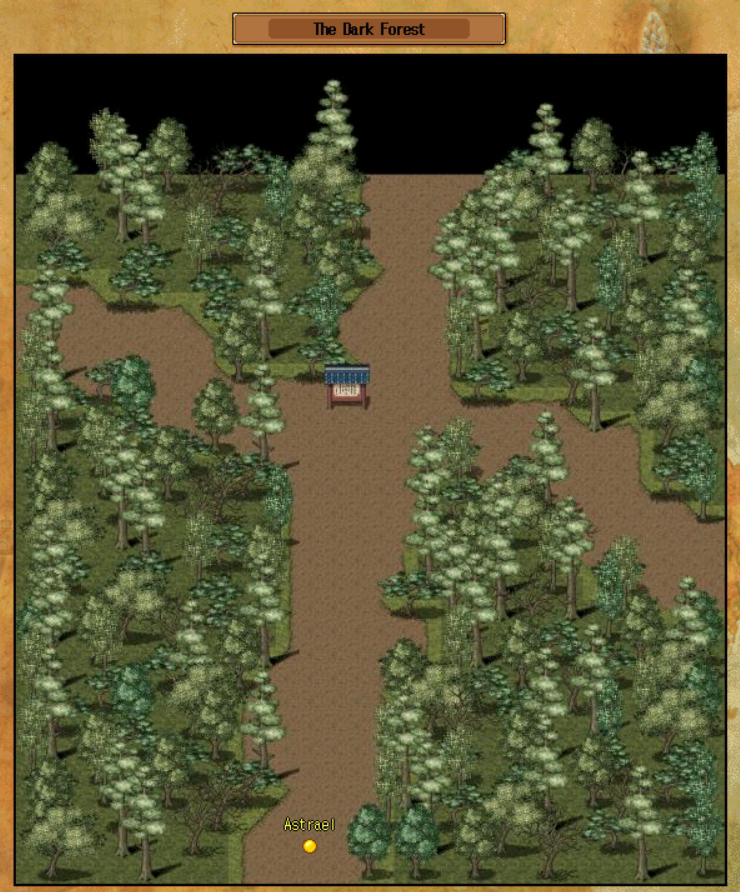

# Nagnag Armory (Shield quest)

_Blight's Armorer Nagnag has captured legendary smiths to force them to produce weapons for the troops. You can't free them, but if you've impressed your path guild, you can grab some goodies off them._

This quest provides bonded shields for every path for every mark.
While you can complete the quest steps without prerequisites, to actually receive a shield at the end you must have completed your Path-specific Nagnang Guild quest.

## Quest Tiers

Most people don't bother with the level 67 shields, and will instead take their level 97 shield sometime after 99. Given that, there are only two tiers of this cave that 'matter' - levels 99 to Il, and Il+. In other words, if you're level 99 and not il, you can only assist other 99-ils, while anyone il or above will enter together in a separate tier.

## Quest Party

While rogues and expert mages can reliably complete the run to the end of the armory by themselves, warriors and poets will most likely need to party up in order to make it safely. As there are only two tiers and the quest doesn't take very long, don't be afraid to ask for help! People are often quite happy to run it with you just for something to do. Just make doubly sure you do in fact have all the required items before you get stuck in.

## Required Items

To complete the quest, you need Nagnang Compasses, Stilts, and a Lockpick. You can borrow all of these, but it's likely best that you make your own during the course of the quest. Unless you have a permanent lightsource like a Lucky Lantern, you will also likely want to make a temporary Lantern.

### Nagnang Compasses

- Acquire 1 fine metal and 1 soup bowl
- Say "Compass" then "Nagnang" in Baek shop, northwest Kugnae
- This nets you ten consumable compasses, although using the trick below you only need one for each visit to the farm.

### Stilts

- Gather 10 ginko wood and 10 wool
- Say "Twine" to the wilderness weaver to turn the wool into twine
- Once are able to talk to the farm ghost during the quest, say "Bridge" to make the stilts

### Lockpick

- Gather 1 Fine Steel Dagger ([Smithing](economy/crafting.md?id=smithing)) and 1 Wood Scraps ([Carpentry](economy/crafting.md?id=carpentry))
- Visit Maso, the Buyan Rogue Guildmaster, and say "Lockpick"

### Lantern

- Gather 1 White paper (messenger shop), 1 flash dust (arena shop), 1 ginko wood, 1 beef (e.g. Mud ox in Kugnae snake cave, or there are Oxen on the Farm), 1 coal (say 'Coal' to Sanhae smith, or buy from clan NPCs)
- Combine Flash dust and Coal in Shift+I creation system to make hot coal
- Combine Hot coal and paper and wood and beef in the Shift+I creation system to make the lantern
- The hot coal / lantern only lasts a few hours, so don't make it until you're ready to brave the sewers

### Shield Materials

Once at the end of the quest, you'll need to provide materials to have your shield constructed.
All shields use a level 95 weapon in their construction, but for the marked shields these weapons will need to be [Enchanted](character/99-equipment.md?id=enchantment) to the appropriate mark first. Note that since these level 95 weapons will all Break on Death, dying during the run through the armory is not an option. All shields also require a small pile of coins, from 24k at 99 to 384k at Sa-san.

Sa-san shields also require Sa-san shield shards, dropped from the Malevolent Clan Houses. A full set of these shards takes a lot of work to farm and is quite valuable.

**Mages**: Scroll of invocation ([Scribes](economy/crafting.md?id=scribing)), mark-specific Surge
**Rogues**: Scroll of defense ([Scribes](economy/crafting.md?id=scribing)), mark-specific Blood
**Poets**: Lantern, mark-specific Charm
**Warriors**: Tall Shield (say "Shield" to Nagnang Smith with 20 ginko wood and 4 fine metal), mark-specific Spike

## Reaching the Farm

Once you've assembled your required items, you'll need to be able to reach the farm. You'll need to enter the Dark Forest from Nagnang, 79/2, north of the palace. The Dark Forest is a confusing place, with the idea being that using compasses will eventually lead you to the exit.

There's a common trick, however - you can instead wander randomly in and out of a room exit until you reach the designated 'end' room, where using a single compass will point you east to the farm. That room can be recognised by its 'plus' shaped path, with map as below:

## The Ghost, Majhum

You will emerge from the dark forest into the Farm. Somewhere in the farm you will find the ghost, Majhum. If you have borrowed your Stilts, this part is optional, but does offer a meaningful karma bonus.

Click on him to talk to him - even though you will not understand him, you should proceed all the way through his prompts without clicking close until the end.

At this point you will need to leave the farm and visit Kugnae's Dusk Shaman in the West. Say "Majhum" and finish the dialogue, then head again through the forest back to the ghost. Say "Bridge" to make your stilts and "Dusk Shaman" to earn ~8 pirate coins of karma.

With Stilts in hand one way or the other, step into the shore on the west side of the hut in the north to wade to the other side.

## Entering the Sewers

On the opposite shore, make your way east, across the bridge to Benitnath's island. Inside his shop, click on him and listen, then say "Sewers". Afterwards, you can enter the sewers through a passage in the northeast corner of his shop. It's at this point that you will want your lantern.

The sewers are pitch black and hard to navigate without a lightsource. Make sure you have "Shadows" turned on in the options for your lightsource to work. Judicious use of the 'm'ap can make the sewers much easier to navigate. For the most part the sewers are linear, although in the one instance where there are multiple exits from a room, you want the furthest one away from the room's entrance. Making it through the sewer's dozen rooms will deposit you outside the armory.

## The Armory

Head East until you reach an eastward-facing gate. Walk up to it and you'll be prompted to use the lockpicks to let yourself up onto the wall. Fight your way north along the wall to let yourself down into the courtyard, and finally into the armory itself.

From the main hall, each path needs to pursue a different direction to reach their shield-granting NPC. Warriors go southwest, poets go north, rogues go northeast, mages go southeast. In practice you can't easily split up here as warriors and poets are unlikely to be able to solo their own routes, so you may have to double back or make two trips if both of you are making shields.

The paths are linear, so after some tricky foes you will eventually find your final NPC. Provided you have completed your path-specific Nagnang Guild quest, these NPCs will take your materials and forge you a new bonded shield.
